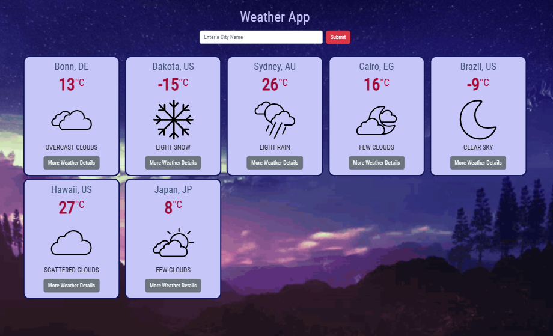
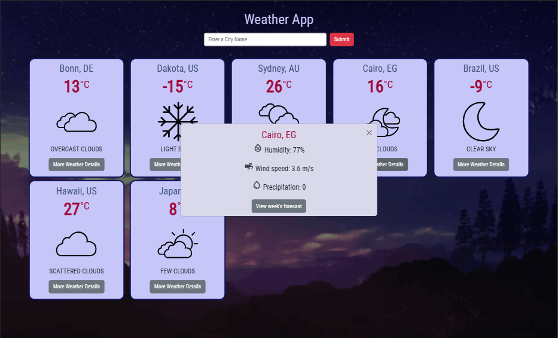
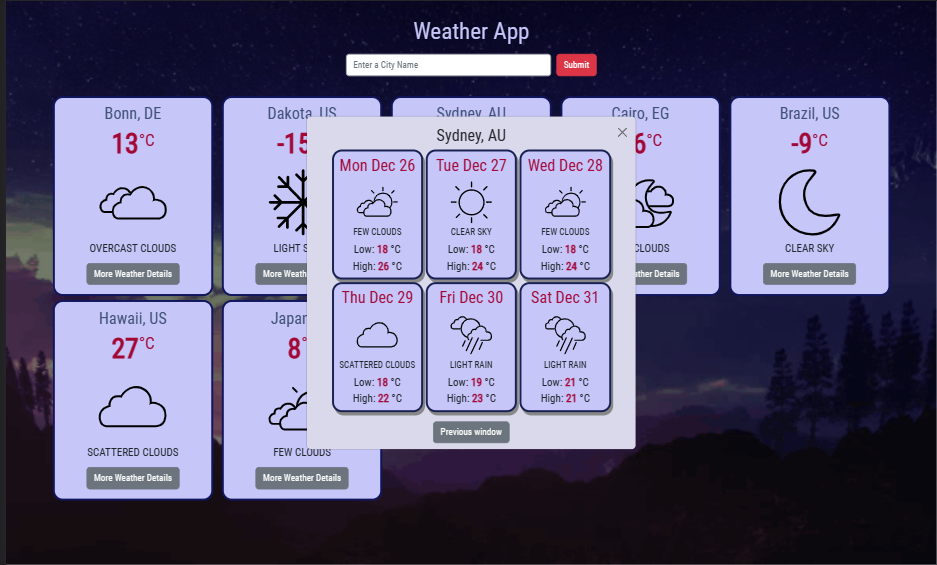
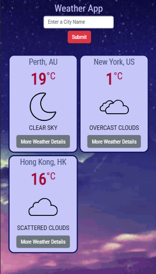

# vanillaJS-responsive Weather Forecast App

### Overview

An asynchronous web app that uses the open weather APIs to update the UI with weather data depending on the city enetered by the user.

### Description

A responsive weather app website that ues Bootstrap for styling, to fetch the weather data; temperature, humidity, wind speed, precipitation and a week forecast. It also takes care of duplicate city inputs and wrong city names entered.

### Demo

#### Weather Data

#### Weather Details

#### Weather Forecast

#### Mobile View

### Credits:

https://stackoverflow.com/questions/74904023/manipulating-5-day-forecast-weather-api-into-getting-daily-temp-hi-low
